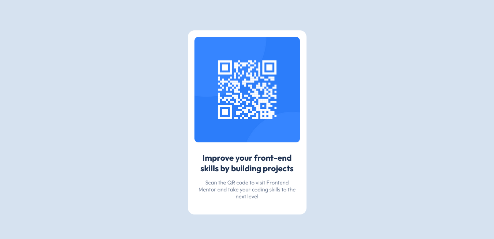

# QR code component solution - Frontend Mentor

This is a solution to the [QR code component challenge on Frontend Mentor](https://www.frontendmentor.io/challenges/qr-code-component-iux_sIO_H). builded by _Mikaias Silva_

## Geral

### Screenshot

### Built with
- Semantic HTML5 markup
- CSS custom properties
- Flexbox

## Author
- Website - [portfolio | Mikaias](https://mikayas.github.io/portfolio/)
- Frontend Mentor - [@mikayas](https://www.frontendmentor.io/profile/mikayas)
